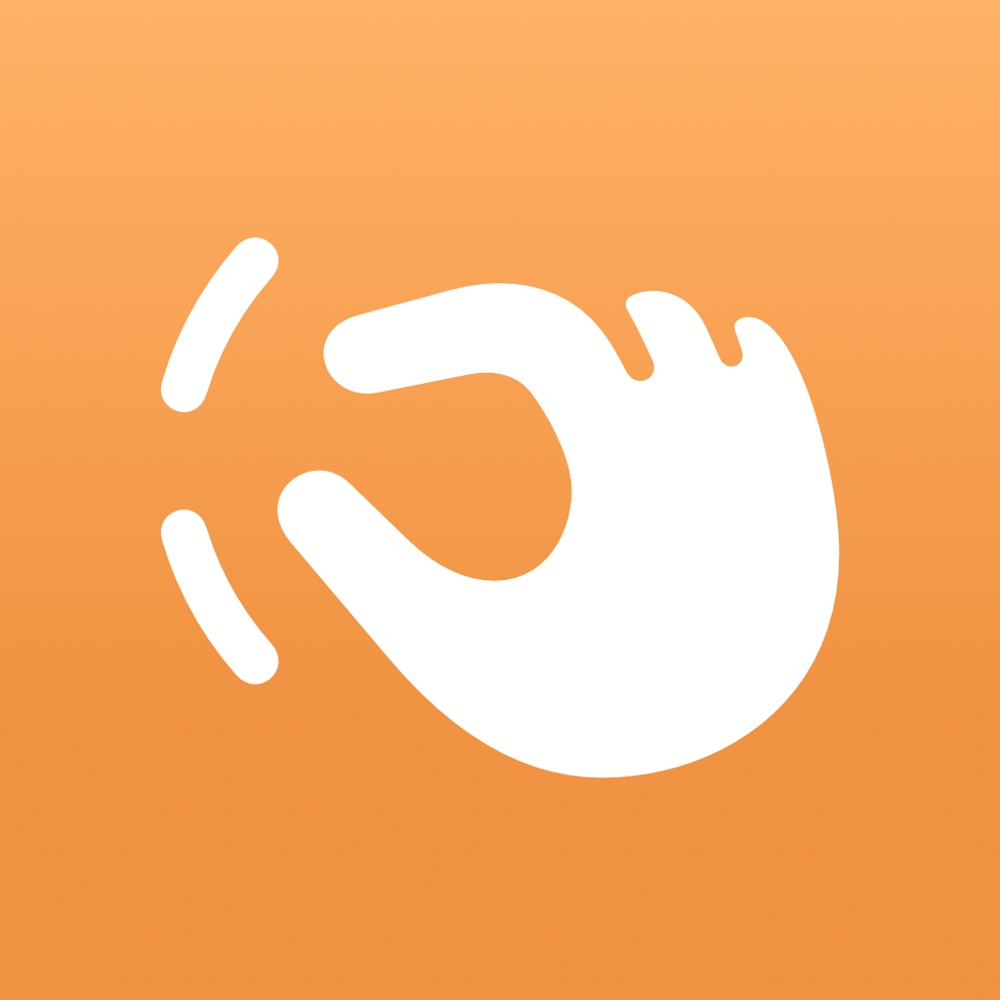

<p align="center">
  
</p>

<h1 align="center">Knuckle</h1>

<p align="center"><b>The hinge is a knuckle. Your phone becomes a finger.</b></p>

<p align="center">
  An iPhone Duo app where folding the phone drives a real robot gripper.<br>
  Record a demonstration, replay it hands-free, export it as robot training data.
</p>

<p align="center">
  Built in one day at <b>Bitrig Hacks: iPhone Duo Edition</b> · Sep 26, 2026 · YC, San Francisco
</p>

---

## What it does

| | |
|---|---|
| **Live control** | Fold the Duo → the gripper closes. Open it → it opens. On screen *and* on a real SO-101 robot arm. |
| **Record & replay** | Record a demonstration, take your hands off, and the robot repeats it exactly. |
| **Export** | Every demonstration is saved as JSON — the kind of data imitation learning trains on. |

## Why

Robot learning runs on human demonstrations. Work like [UMI](https://umi-gripper.github.io/) showed you don't need the robot in the room to collect them — but you still need special hardware. Until now, no iPhone had a hinge you can measure. **Folding is a squeeze — the same motion as a gripper.** So the hardware can be a phone.

## iPhone Duo APIs used

| API | Used for | File |
|---|---|---|
| `onHingeChange` · `DeviceHinge.angle` / `.status` | Hinge angle drives the gripper; closing the phone auto-stops recording | `ContentView.swift` |
| `onHingeChange(isEnabled:)` | Pauses live hinge input during replay | `ContentView.swift` |
| `ArrangementView` + `.split` | Gripper and controls split along the real crease in every pose | `ContentView.swift` |
| `reservedRegions(kind: .division, options: .includeInactive)` · `.occlusion` | Keeps controls off the fold (reported *inactive* when flat) and the status bar | `ReservedRegionPadding.swift` |

Also: Swift Charts (live angle curve + replay cursor), share-sheet JSON export, URLSession link to the robot.

## How it works

```
 iPhone Duo hinge (60°–180°)
        │  onHingeChange
        ▼
 gripper = clamp((θ − 60) / 120 × 100, 0, 100)
        │
        ├──► on-screen gripper + chart
        ├──► Recorder: fixed 30 Hz samples  ──► JSON export
        └──► ArmLink: POST /gripper (≤20 Hz) ──► Python bridge ──► SO-101 gripper servo
```

- **Recording** samples at a fixed 30 Hz with strictly increasing timestamps. If the sampler wakes late, it skips the missed slot — it never invents a duplicate sample.
- **Replay** runs on a 60 fps clock with linear interpolation, so the gripper, numbers and chart cursor move smoothly.

### Data format

```json
{
  "episode_id": "99cba474-186b-43d0-a535-fd47c847e39f",
  "created_at": "2026-09-26T19:17:57Z",
  "sample_rate_hz": 30,
  "samples": [ { "t": 0.0, "hinge_deg": 180, "gripper": 100 } ]
}
```

A real episode recorded at the hackathon is in [`data/sample_episode.json`](data/sample_episode.json).

## Repo layout

```
App/        iOS app (SwiftUI, built in Bitrig)
  ContentView.swift            hinge input, layout, controls
  Recorder.swift               30 Hz recording, replay, gripper mapping
  AngleChartView.swift         Swift Charts curve + replay cursor
  Export.swift                 JSON episode export
  ArmLink.swift                sends gripper values to the robot bridge
  ReservedRegionPadding.swift  keeps content off the crease
  GripperDrawing.swift         on-screen gripper
bridge/     bridge.py — local HTTP → SO-101 gripper servo (Python, LeRobot fork)
data/       sample exported episode
```

## Run it

1. Open the project in [Bitrig](https://bitrig.com) (or Xcode 27.1) and run on the **iPhone Duo simulator (iOS 27.1)**.
2. Optional — real arm: connect a Hiwonder SO-101 follower arm, then
   ```bash
   python bridge/bridge.py   # listens on 127.0.0.1:8765
   ```
   and turn on **Arm link** in the app.

## What's next

The hinge is one of three signals robots learn from. On a real Duo, the camera adds **vision** and the phone's motion adds **trajectory** — one phone, all three signals.

## Note on code

The iOS app was written entirely at the hackathon in Bitrig. `bridge/bridge.py` was prototyped the night before to confirm the arm works with a Mac; disclosed to and approved by the organizers.

## Team

Jolin · LJ
